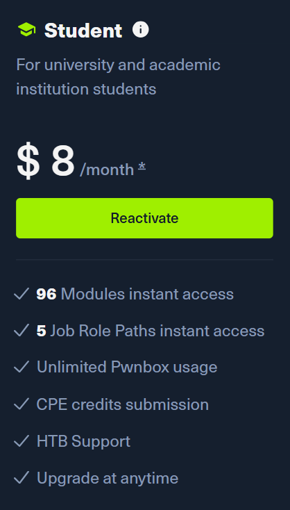

Welcome to the first post of this blog! Here, I'd like to talk about the first steps I took when I was just starting in cybersecurity in early 2024 as a way of introducing myself. If you're just starting out, you can take some inspiration from here, and if you're not, hopefully you'll still find this fun to read. 

## Prior Knowledge
Before getting into cybersecurity, I already had some years of studying computer science in school, university, as well as my own spare time behind me. I had some knowledge of programming, computer architecture, operating systems, plus other bits and pieces of theory you typically pick up in curriculum. Over the years, I became more and more interested in how computers work at a very basic, low level, so when the "Security & Networks" module began at my university two years ago, I was naturally drawn into the topic and started searching for ways to dig deeper into it.

## Installing Linux
The first thing on my to-do list was installing and getting to know Linux since most security tools operate best (or even exclusively) on it, and it's also run by a vast majority of servers and other environments out there. There are several installation options for Linux: virtual machine (VM), Windows Subsystem for Linux (WSL), dual booting, or just replacing Windows entirely. Out of those options, I chose to set up a Linux VM on my Windows system as it was the least invasive option that still allowed me to get a proper Linux experience. While VMs are notorious for being tricky to set up and sluggish, I was satisfied with the performance on my machine, so I just kept using a VM.

As for the choice of the Linux distribution, there are a few distros that come with various pre-installed tools for cybersecurity, such as [Kali Linux](https://www.kali.org/) and [Parrot OS](https://parrotsec.org/). Kali Linux has been around for longer, has a more mature ecosystem and documentation, and is a de-facto standard in the professional world, whereas Parrot OS is a more lightweight and newer distro, though it has an active community and is being actively developed. In terms of tools, both will have enough for you to get started with a good level of comfort.

Personally, as a beginner, I found Kali more than manageable to use and didn't have any deal-breaking issues with it. I also tried using Parrot, but it was having some strange UI issues on my VM, so I gave it up in favor of Kali. 
>ParrotSec has recently released a [Hack The Box edition](https://parrotsec.org/download/?edition=hackthebox) of Parrot OS which specifically has most popular tools and workflows used by the community on HTB, so that may be something worth looking into if you're interested.

This post is not intended to be a Linux installation/VM setup guide, so I won't go into detail on the installation process here, but here are some helpful resources:
- [Microsoft's WSL installation guide](https://learn.microsoft.com/en-us/windows/wsl/install) (also check out [Win-KeX](https://www.kali.org/docs/wsl/win-kex/#installation) for a Kali Linux GUI in WSL)
- Kali Linux [installation](https://www.kali.org/docs/installation/) / [virtualization](https://www.kali.org/docs/virtualization/)
- Parrot OS [installation](https://parrotsec.org/docs/installation/) / [virtualization](https://parrotsec.org/docs/virtualization/)

After installing Linux, here are the resources I used and things I did as a part of my learning process.

## OverTheWire -- Bandit Wargame
In my opinion, the best place to get started with security is the OverTheWire's [Bandit wargame](https://overthewire.org/wargames/bandit/). It was the very first thing that I completed once my VM was set up.

First of all, the OverTheWire wargames are series of small levels that can help you learn and practice security concepts, and Bandit is their easiest wargame aimed at absolute beginners. This game consists of 34 small levels that will teach you the Linux command line and, more importantly, the mindset of thinking outside of the box. It's a great place to start, I've recommended it lots of times to those who were starting out, and here I am recommending it once again. You will have to do plenty of self-learning and think creatively, which are absolutely essential skills in cybersecurity.

I also completed the Leviathan, Narnia, and (partially) Natas wargames after Bandit, and I highly recommend all of them for learning about various security domains.

## Hack The Box (HTB)
Oh boy, this is where I've done the most of my learning and practice _by far_. HTB is a cybersecurity training platform which has two main parts that you should be concerned about as a beginner: Academy and Labs. 

### Academy
Academy is a place for you to learn theory alongside doing practical exercises. The topics are organised in **modules**, which can either cover offensive security, defensive security, or general theory, such as operating systems, programming languages, networking, etc. The modules are unlocked using an internal currency called **cubes** (which you will get some amount of at the start), and their cost depends on the module's **Tier** (0-4). 

Tier 0 modules cost 10 cubes, which you can actually get back by completing all the exercises in a module, essentially making the Tier 0 modules **free**. The higher the Tier of the module, the higher the cost, and for the modules of Tier 1 and above, you can only get 20% of the cubes back upon completing all the module's exercises. 

You can either buy cubes via a one-time purchase (10 cubes/USD) or via a subscription (at a better rate). There are also some **annual subscriptions** which provide you direct access to modules (instead of cubes) as well as some other benefits, but I'd like to pause at one plan in particular which was the only reason I considered paying at all -- **the Student plan**.

This plan gives you direct access (no spending cubes required) to all Tier 0-2 modules for 8 USD/month. In my personal opinion, it's a great value for the price. All the content you get access to can keep you busy for quite a while, and it also allows you to work through some of the HTB's job role paths, such as Junior Cybersecurity Analyst, Penetration Tester, and SOC Analyst, which also give you access to their respective certification exams upon completion.
>If you manage to complete more than 80 cubes' worth of exercises in a month, you effectively get more than 10 cubes for 1 USD and get to keep all the finished modules, without having paid a single cube for them!.

One thing to be aware of with Academy is that even though it does teach you, the answers to _some_ questions or the steps needed to reach them won't be given to you directly, and you will have to go an extra mile and do some research on your own in order to find a way to do what you need to. While it can certainly be frustrating, I prefer treating these moments as training for the real-world security, where many answers won't be given to you on a silver platter :)

If you're just getting started, I'd recommend you to take the **Cracking Into Hack The Box** and **Information Security Foundations** paths first to make sure your basics are solid, and then move on to learning whatever you find more interesting.

### Labs
Labs are where you can put your skills to use by solving more serious problems than those given in the Academy. There are three main types of those here: **machines** (full exploitable VMs simulating real-world targets), **challenges** (smaller and more specialized tasks that focus on a particular skill), and **sherlocks** (investigation-oriented exercises where you follow a series of leads and questions). There also more complex environments available here for more advanced players, but don't worry about those at the start.

New content is constantly being released. After release, the machines/challenges/sherlocks stay available to everyone (or **active**) for a certain amount of time, and become **retired** afterwards, meaning only the users with a paid subscription can access them. Furthermore, when a piece of content gets retired, an official walkthrough for it becomes available (again, only to the paid users).
>Labs subscriptions are separate from Academy subscriptions!

The content here is intended for **unguided learning** apart from two exceptions:
- **Starting Point** -- a collection of machines with walkthroughs available meant to teach you the basics of offensive security. Thanks to the walkthroughs, you can actually jump into them right after setting up Linux and getting at least a bit of knowledge, for example, by completing the **Cracking Into Hack The Box** path.
- Some machines/challenges/sherlocks with walkthroughs available even while they're active, although those are pretty rare.
>There's no shame in sticking to the very easy/easy labs at the start. Actually, you can learn about quite a large variety of topics from them as a beginner.

## Capture the Flag Competitions (CTFs)
CTFs are individual/team-based events where you can compete against other players by solving challenges (known as **jeopardy** CTFs, more beginner-friendly) or defending your infrastructure & attacking other players (known as **attack-defense** CTFs), and earning points. Fastest to solve all challenges or score the highest number of points wins! The challenge categories typically include digital forensics, binary exploitation, reverse engineering, and web, but other categories like OSINT and misc may be available depending on the event.

The majority of CTFs take place online over the weekends so that more people can participate. There are CTFs for various experience levels, and once you feel more comfortable with your ability to solve challenges, it's totally worth participating in one! [ctftime.org](https://ctftime.org/) has a list of upcoming and past CTFs, as well as some CTF organizers. Take a look there and see which one may suit you better.

If you're in a school/university, find out if there are any existing CTF teams, or if there's anyone who's playing in CTFs in general. If you aren't in one or haven't managed to find anyone, the organizers of the CTFs usually create Discord servers with a dedicated "looking for team" channel.

After the CTFs end, the players also publish **write-ups** on challenges they've completed to share their solutions and solidify their knowledge. Even if you feel like what you've solved was easy, they're still worth writing and sharing for the sake of your own information retention and practicing communicating your findings.

## Note-taking
Another important part of the learning process is taking notes. You will be dealing with lots of new information (at the time of writing, my knowledge base consists of tens of notes and 150,000+ total words), some of which you will naturally forget over time. Having your own knowledge base will save you time and energy when you want to revisit some concepts, quickly look up a random command, or see how you solved some exercise/challenge in the past when you encounter a similar one in the future. 

Personally, I use [Obsidian](https://obsidian.md/), but some other popular choices for taking notes are [Notion](https://www.notion.com/notes) and [CherryTree](https://www.giuspen.net/cherrytree/).

## Other Resources
- [picoGym](https://picoctf.org/) (recently rebranded to CyLab Security Academy) -- collection of challenges from the past picoCTFs organized by the Carnegie Mellon University
- LiveOverflow's [Binary Exploitation playlist](https://youtube.com/playlist?list=PLhixgUqwRTjxglIswKp9mpkfPNfHkzyeN&si=KVrXejrTQDsJYVTW)
- PortSwigger's [web security materials](https://portswigger.net/web-security/all-materials)
- Exploit Education [machines](https://exploit.education/)
- Probably some other resources I no longer remember about...
- Ultimately, there are a lot of resources out there (websites, books, YouTube, Discord servers, etc.) you can use for learning. Do your own research, try out different things, figure out what works for you best.

## General Tips
- Make sure your basics of computer science like programming, operating systems, and networking are solid, because cybersecurity builds up on **all of them**. Take time to fill in the gaps if there's something you don't fully understand instead of pushing through or rushing ahead. Depending on your level of knowledge, your journey might be different.
- Take breaks when you're feeling overwhelmed/overloaded with information. Take a step back, figure out what exactly you don't understand, do research on it, take notes. [Break things down](https://en.wikipedia.org/wiki/Learning_by_teaching#Plastic_platypus_learning) and lay them out for yourself in the simplest way possible.
- Focus on personal projects and really understanding how things/computers/tools/ \<insert concept here\> work rather than just getting certifications. 
    - On a similar note, the certs that get you hired aren't always the best for developing your actual skils, and vice versa.

Hopefully you found something useful in this post. Happy hacking!